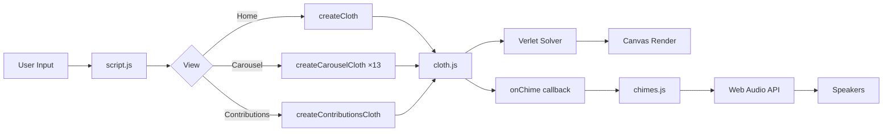
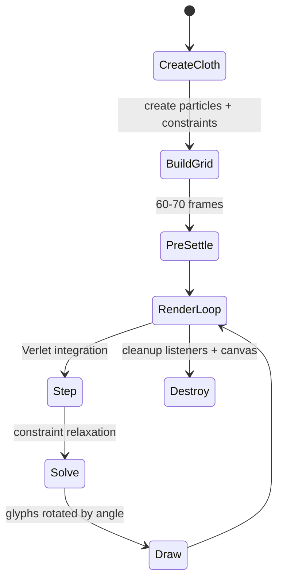
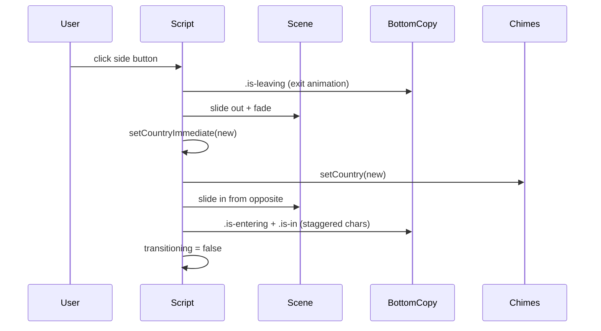

# Chimes — Budarina

**Interactive portfolio experience** by [Marina Budarina](https://budarina.design): country roofs, letter-cloth physics, destinations carousel, and procedural chimes.


---

## ✨ What is this?

A digital "beaded doorway curtain" for each country — letters hang from a virtual roof, sway with physics, and emit country-specific chimes when you interact with them.

| Feature | Description |
|---------|-------------|
| **13 Countries** | China, Japan, Vietnam, Kazakhstan, Russia, France, India, UK, Norway, Italy, USA, Brazil, Iran |
| **Verlet Cloth** | Unified physics engine for home, carousel, and contributions views |
| **Procedural Audio** | Zero samples — each country has a synthesized timbre (bronze bells, glass furin, temple gongs…) |
| **Destinations Carousel** | Horizontal scroll with scale/perspective, live cloth under each roof |
| **Contributions** | Visitors add country names → woven into a hanging cloth curtain |
| **Tweakpane Panel** | Press ` ` (backtick) to tune gravity, damping, stretch, chime volume… |

---

## 🎬 Demo

```bash
# From source (with ES modules)
cd src && python3 -m http.server 8080
# Open http://localhost:8080

# Or from built dist
cd dist && python3 -m http.server 8765
```

**Keyboard shortcuts:**
- ` ` (backtick) — open/close physics panel
- `Esc` — close panel / close About modal
- `←` `→` — navigate carousel (in Destinations)
- `Enter` — select centered country (in Destinations)
- `Tab` — focus trap in modals

---

## 🏗 Architecture

```
src/
├── index.html          # Entry point, semantic markup
├── style.css           # Fluid layout, CSS vars per country, reduced-motion
├── script.js           # Orchestration: views, transitions, cloth lifecycle
├── cloth.js            # Verlet engine (unified: home, carousel, contributions)
├── chimes.js           # Web Audio API synthesis per country
├── countries.js        # Data: cloth text, grid, writing direction, roof assets
├── contributions.js    # Lazy-loaded: name validation, grid layout, persistence
├── utils.js            # Shared helpers (smoothstep, grid math)
└── stage-strings.js    # Dev demo (not shipped)
```

### Core Principles

| Principle | Implementation |
|-----------|----------------|
| **Single Responsibility** | `cloth.js` = physics only; `chimes.js` = audio only; `countries.js` = data only |
| **Dependency Inversion** | `createCloth()` receives callbacks (`onChime`, `onPointerGuard`) — knows nothing about UI |
| **DRY** | One `createCloth()` powers 4 cloths (home, carousel×13, contributions, dev) |
| **Parametrization** | Gravity, damping, iterations, compress/stretch, pad, mode — all configurable |

---

## ⚙️ How It Works

### The Cloth (Verlet Integration)

```
Particle (letter) ── Constraint (spring) ── Particle
       │                                          │
       ▼                                          ▼
  pinned (row 0)                            free (rows 1…N)
       │                                          │
       └───── gravity + damping + constraint solve ────► hangs naturally
```

- **Row 0 pinned** → "curtain rod"
- **Verlet integration**: `pos += (pos - oldPos) * damping + gravity * dt²`
- **Constraints**: vertical = strings (stiff), horizontal = spacers (loose)
- **Pre-settle**: 60–70 frames before first paint so cloth hangs at rest
- **Render**: each glyph rotated by its vertical constraint angle

### The Chimes (Procedural Synthesis)

```javascript
// Per-country profile (chimes.js)
china: {
  freqs: [261, 293, 329, 392, 440, 523, 587, 659],  // C major-ish
  partials: [{ratio: 1, gain: 0.62}, {ratio: 2.76, gain: 0.22}, …],
  duration: 1.45, attack: 0.018, droop: 0.988,
  noiseDur: 0.05, noiseQ: 2.5, noiseMul: 1.6,       // metallic "clang"
  shelfHz: 1200, shelfGain: 1,
  minIntervalMs: 70
}
```

- **Pitch by column**: `particle.id % gridW` → chooses note from country's scale
- **Trigger**: nearest particle to cursor within 55px radius
- **Intensity**: based on mouse speed + proximity
- **Web Audio**: `OscillatorNode` (sine partials) + band-pass noise for attack

---

## 🧪 Development

### Physics Panel (Tweakpane)

Press <kbd>`</kbd> (backtick) to open:

| Folder | Parameters |
|--------|------------|
| **Cloth** | Width, Height, Columns, Rows |
| **Motion & Sound** | Gravity, Damping, Precision, Stretch, Compress, Touch Radius, Touch Force, Chimes On/Off, Volume, Keep in Bounds |

Changes apply live — click **Rebuild cloth** to reset.

### Adding a Country

1. Add assets to `src/`:
   - `roof-<id>.webp` (roof image)
   - `selector-<id>.webp` (side button icon)
2. Add entry to `COUNTRIES` in `countries.js`:
   ```js
   newCountry: {
     id: "newcountry",
     name: "New Country",
     roof: "./roof-newcountry.webp",
     buttonIcon: "./selector-newcountry.webp",
     writing: "horizontal", // or "vertical"
     gridW: 40, gridH: 30,
     cloth: "TEXT FOR THE CLOTH",
     eyebrowNative: "原文",
     eyebrowRoman: "Romaji",
     eyebrow: "English meaning",
     title: "New Country — poetic description",
     aside: "Longer atmospheric text…",
     font: '"Custom Font", fallback',
   }
   ```
3. Add to `COUNTRY_ORDER` array (defines carousel sequence + side-button neighbors)
4. Add CSS vars in `style.css` for roof positioning (see existing countries)
5. Add chime profile in `chimes.js` → `COUNTRY_CHIMES`

### Reduced Motion

Respects `prefers-reduced-motion: reduce`:
- Physics disabled (gravity=0, damping=1, 1 iteration)
- Transitions instant
- Cloth pre-settles instantly

---

## 📊 Architecture Diagrams

### Data Flow



### Cloth Lifecycle



### Country Transition



---

## ⚡ Performance Considerations

| Aspect | Strategy |
|--------|----------|
| **DPR Handling** | `dpr = Math.min(3, Math.max(1, devicePixelRatio))` — caps at 3× |
| **Canvas Sizing** | CSS `width/height` + `canvas.width/height = css * dpr` — sharp on retina |
| **Glyph Atlas** | Each unique char rasterized once to offscreen canvas, reused |
| **Constraint Solver** | 5 iterations/frame (configurable), spacers cheaper than strings |
| **Settle Frames** | Runs *before* first paint — no flash of flat cloth |
| **Animation Loop** | `requestAnimationFrame` with `dt` clamping (max 32ms) |
| **Reduced Motion** | Gravity=0, damping=1, 1 iteration — effectively static |
| **Lazy Load** | `contributions.js` loaded on demand (dynamic `import()`) |
| **Memory** | `destroy()` removes listeners, clears canvas, nulls refs |

### Canvas Dimensions (Desktop)

| View | Logical Size | Canvas Size (with pad) |
|------|--------------|------------------------|
| Home | 492×468 | 1332×1308 (pad 420) |
| Carousel Item | 492×468 | 1332×1308 (pad 420) |
| Contributions | fluid | fluid (pad 56) |

---

## 🌐 Browser Support

| Feature | Minimum Version | Fallback |
|---------|-----------------|----------|
| ES Modules | Chrome 61, FF 60, Safari 11, Edge 16 | None required |
| Web Audio API | Chrome 14, FF 25, Safari 14, Edge 79 | Chimes disabled gracefully |
| `requestAnimationFrame` | Universal | Polyfill if needed |
| `IntersectionObserver` | Chrome 51, FF 55, Safari 12.1 | Not used |
| `ResizeObserver` | Chrome 64, FF 69, Safari 13.1 | Contributions view degrades |
| `prefers-reduced-motion` | Chrome 74, FF 63, Safari 10.1 | Honored if supported |

**Tested on:** Chrome 120+, Firefox 115+, Safari 17+, Edge 120+

---

## 🐛 Troubleshooting

| Symptom | Cause | Fix |
|---------|-------|-----|
| **No sound** | Autoplay policy | Click anywhere first (user gesture required for AudioContext) |
| **Sound delayed** | AudioContext suspended | `await chimes.ensure()` on first interaction |
| **Cloth not rendering** | Canvas 0×0 | Check `host` element exists and has dimensions |
| **Particles explode** | `dt` too large | Clamp `dt = Math.min(32, now - last)` |
| **Carousel jank** | Too many cloths active | Only center ±1 items have `setActive(true)` |
| **Mobile layout broken** | CSS vars not applied | Verify `--area-w` / `--area-h` in media query |
| **Chimes not country-specific** | Profile not loaded | Check `COUNTRY_CHIMES[id]` exists in `chimes.js` |
| **Memory leak on view switch** | Listeners not removed | Ensure `destroy()` called on old cloth |

---

## 🔧 API Reference

### `createCloth(options)` — `cloth.js`

```typescript
interface ClothOptions {
  host: HTMLElement;           // parent for canvas
  text: string;                // glyph source
  writing?: "horizontal" | "vertical";
  width: number;               // logical grid width (CSS px)
  height: number;              // logical grid height
  gridW: number;               // columns
  gridH: number;               // rows
  pad: number;                 // canvas padding around grid
  fontSize: number;
  font: string;                // CSS font stack
  dpr: number;                 // device pixel ratio
  gravity?: number;            // default 0.2
  damping?: number;            // default 0.99
  iterations?: number;         // default 5
  compressFactor?: number;     // default 0.02
  stretchFactor?: number;      // default 1.1
  contain?: boolean;           // default false
  mouseSize?: number;          // default 5000
  mouseStrength?: number;      // default 4
  mode?: "interact" | "simulate"; // default "simulate"
  settleFrames?: number;       // default 0
  onChime?: (opts: ChimeOpts) => void;
  onPointerGuard?: (e: Event) => boolean;
}

interface ChimeOpts {
  x: number; y: number;
  particle: Particle;
  gridW: number;
  intensity: number;
  force?: boolean;
  reset?: boolean;
}
```

**Returns:**
```typescript
interface ClothAPI {
  canvas: HTMLCanvasElement;
  tick: (dt: number) => void;
  brush: (cx: number, cy: number, opts?: {chime?: boolean}) => void;
  containsPoint: (cx: number, cy: number) => boolean;
  setActive: (v: boolean) => void;
  setPhysics: (p: {compressFactor: number, stretchFactor: number}) => void;
  destroy: () => void;
}
```

### `StringChimes` — `chimes.js`

```typescript
class StringChimes {
  static async create(): Promise<StringChimes>;
  setCountry(id: string): void;
  setVolume(v: number): void;  // 0–1
  async strike(opts: StrikeOpts): Promise<void>;
  get enabled(): boolean;
  set enabled(v: boolean);
}

interface StrikeOpts {
  x?: number; y?: number;
  particle?: {id: number};
  gridW?: number;
  intensity?: number;
  force?: boolean;
}
```

---

## 🤝 Contributing

### Code Style

- **ES Modules** — `import`/`export` only, no bundler
- **No dependencies** — except Tweakpane (CDN) and Google Fonts
- **Vanilla JS** — no framework, minimal abstractions
- **JSDoc types** — `@typedef` + `@param` for IDE support
- **Constants over magic numbers** — see `PARTICLE_RADIUS`, `CHIME_RADIUS`

### PR Checklist

- [ ] `prefers-reduced-motion` tested
- [ ] Mobile layout verified (≤960px)
- [ ] Keyboard navigation works (Tab, arrows, Enter, Esc)
- [ ] No console errors in all 3 views
- [ ] New country follows adding guide above
- [ ] Chime profile matches cultural timbre (research!)

### Local Dev

```bash
cd src
python3 -m http.server 8080
# Open http://localhost:8080
# Press ` to open Tweakpane panel
```

---

## 📝 Changelog

### v2.0 (Phase 2) — 2026-08
- Unified cloth engine (`cloth.js`) — replaced 4 duplicated implementations
- WebP assets for all roofs/selectors
- Accessibility overhaul (ARIA, focus trap, reduced motion)
- SEO meta tags, Open Graph, Twitter cards
- Contributions view with seeded country cloth
- Destinations carousel with live cloth per item

### v1.0 — 2026-07
- Initial release: home cloth, 8 countries, basic chimes
- Side-button navigation
- About modal

---

## 📄 License

- **Design & assets** — Marina Budarina, all rights reserved (see [LICENSE.txt](./LICENSE.txt))
- **Cloth physics foundation** — Adapted from [Liam Egan on CodePen](https://codepen.io/shubniggurath/pen/ZYpjorm) (MIT)
- **Code** — MIT (feel free to learn from the physics/audio engines)

---

## 🙏 Credits

- **Design, product, countries, transitions, chimes, assets** — Marina Budarina
- **Strings physics inspiration** — Liam Egan ([CodePen](https://codepen.io/shubniggurath/pen/ZYpjorm))
- **Fonts** — PP Eiko (display), JetBrains Mono (UI)
- **Tweakpane** — UI panel library

```bash
# No build step required — pure ES modules
# Deploy src/ to any static host (Netlify, Vercel, GitHub Pages, Cloudflare Pages)

# If you want a dist/ copy:
rsync -av src/ dist/ --exclude='*.js.map' --exclude='stage-strings.js'
```

---

## ♿ Accessibility

- Semantic HTML (`<nav>`, `<button>`, `<dialog>` roles)
- `aria-label` / `aria-expanded` / `aria-controls` on all interactive elements
- Focus visible outlines, focus trap in modals
- `prefers-reduced-motion` honored globally
- Keyboard navigation: carousel arrows, Enter to select, Tab order
- Screen reader: cloth regions `aria-hidden`, live regions for hints

---

## 📄 License

- **Design & assets** — Marina Budarina, all rights reserved (see [LICENSE.txt](./LICENSE.txt))
- **Cloth physics foundation** — Adapted from [Liam Egan on CodePen](https://codepen.io/shubniggurath/pen/ZYpjorm) (MIT)
- **Code** — MIT (feel free to learn from the physics/audio engines)

---

## 🙏 Credits

- **Design, product, countries, transitions, chimes, assets** — Marina Budarina
- **Strings physics inspiration** — Liam Egan ([CodePen](https://codepen.io/shubniggurath/pen/ZYpjorm))
- **Fonts** — PP Eiko (display), JetBrains Mono (UI)
- **Tweakpane** — UI panel library